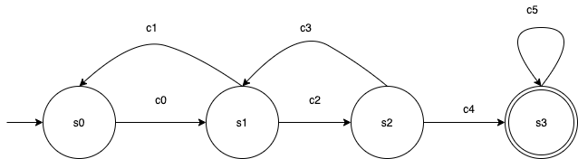

# nose (Graduate Design)
Design and implementation of VPN based on p2p network.


## Project structure

```

                                              +--------------+       +---------------+       +--------------+
                                       +----->| local client |<----->| public server |<----->| local client |<-----+
                                       |      +--------------+       +---------------+       +--------------+      |
                                       |                                                                           |
 +---------+        +-------------+    |                                                                           |    +-------------+       +--------+
 |  peer A | <----->| utun device |<---+ |<---------------------------- VPN tunnel ----------------------------->| +--->| utun device |<----->| peer B |
 +---------+        +-------------+                                                                                     +-------------+       +--------+
```

**Note**: This project uses a host assigned a public net address as a trunking server instead of p2p traversal through complex NATs models. This can make the whole process more easy but burden the server much more pressure for transmitting the data from two sides.
## Project requirements
This project built depends on some third party open sources.

Dependencies list:
```
libuv 1.31.1-dev
openssl 1.1.1d
mbedtls 2.25.0
```

## Command line usage

```
nose is a very simple VPN implementation over p2p

Usage: nose [server|client] 
  -l IP address assigned to the utun interface of local machine
  -r IP address assigned to the other peer of p2p
  -sh IP address of public server for forwarding the traffic
  -sp Port number given to the public server


Examples:
In client:
nose client -l 10.1.0.10 -r 10.1.0.20 -sh x.x.x.x -sp 9090
In server:
nose server -sh x.x.x.x -sp 9090

```
**Note**:

For the server, firstly make sure your firewall software allow to access to the port you assign to the program, or it will make the connection failed. Addtionally, although even you shutdown the firewall, the problem would still occur partly because your host provider builds the firewall in the traffic entrance of the server. To solve this, login to your console panel and add the accessible rules accordingly. 

For the client, the program should be run as superuser or other users which are equal to the privilege of superuser. 

## VPN protocol(draft)
###  Preface
Comparing with serveral famous VPN protocol——PPP, PPTP, SSL VPN, etc. and learning their natures and features, I finally present a relatively simple and available VPN protocol(Under consideration) conbined with respectively advantages, including the **Authentiction** and **Encryption** which both meet the almost application scene for safety and protection.

### Authentication
It references from CHAP, Challenge-Handshake Authentication Protocol, which is applied in Point-to-Point Protocol(PPP). And I omit the previous Link Control Protocol for exchanging the id bewteen two sides, and use the random number to generate the id and challenge. Like CHAP, the whole process vertifies the identity of the client by using a there-way handshake. The vertifiction is based on a shared secret previously negotiated.

#### Work cycle

### Encryption 

### Packet format
I define the commom VPN protocol header for **Authentication**, **Key negotiation**, and **Encrypted payload**. The specific format lists as follows.
 
```
 0                   1                   2                   3
 0 1 2 3 4 5 6 7 8 9 0 1 2 3 4 5 6 7 8 9 0 1 2 3 4 5 6 7 8 9 0 1
+-+-+-+-+-+-+-+-+-+-+-+-+-+-+-+-+-+-+-+-+-+-+-+-+-+-+-+-+-+-+-+-+
|      Type     |     Code      |          Call ID              |
+-+-+-+-+-+-+-+-+-+-+-+-+-+-+-+-+-+-+-+-+-+-+-+-+-+-+-+-+-+-+-+-+
|           Length              |          Reserved0            |
+-+-+-+-+-+-+-+-+-+-+-+-+-+-+-+-+-+-+-+-+-+-+-+-+-+-+-+-+-+-+-+-+
| Options...                                                    |
+-+-+-+-+-+-+-+-+-+-+-+-+-+-+-+-+-+-+-+-+-+-+-+-+-+-+-+-+-+-+-+-+
```

Type:

  0: Authentication

  1: Key negotiation

  2: Encrypted payload

Code:

  For the Authentiction, the Type field should be set as 0. Code is 0, if the packet is used to request for authentiction. Code is 1, the packet is authentiction respose.

  For the Key negotiation, the Type field should be set as 1. The Code must be zero.

  For the Encrypted payload, the Type field should be set as 2.
  The Code must be zero.


Call ID:

It is initialized by client which marks the unique session. Client should carry the Call ID on every packet transmission. The Call ID would be destoryed with the session closed or the connection dead.

Length:

The bytes of whole packet length.

Reserved0:

It must be zero.

Options:

1. Authentiction 
   
   1.1. Authentiction request
  
  ```
0                   1                   2                   3
 0 1 2 3 4 5 6 7 8 9 0 1 2 3 4 5 6 7 8 9 0 1 2 3 4 5 6 7 8 9 0 1
+-+-+-+-+-+-+-+-+-+-+-+-+-+-+-+-+-+-+-+-+-+-+-+-+-+-+-+-+-+-+-+-+
|      Challenge                |   Hash Method |    Reserved1  |
+-+-+-+-+-+-+-+-+-+-+-+-+-+-+-+-+-+-+-+-+-+-+-+-+-+-+-+-+-+-+-+-+
| Options...                                                    |
+-+-+-+-+-+-+-+-+-+-+-+-+-+-+-+-+-+-+-+-+-+-+-+-+-+-+-+-+-+-+-+-+


  ```

Challenge:

16 bits random number generated by client.

Hash Method:

It only supports sha256 which is 0, other is reserved.

Reserved1:

It must be zero.

Options:

A hexadecimal hexdigest generated by hash method defined in hash method field.


  1.2 Authentiction response

```
0                   1                   2                   3
 0 1 2 3 4 5 6 7 8 9 0 1 2 3 4 5 6 7 8 9 0 1 2 3 4 5 6 7 8 9 0 1
+-+-+-+-+-+-+-+-+-+-+-+-+-+-+-+-+-+-+-+-+-+-+-+-+-+-+-+-+-+-+-+-+
|      Challenge                |  Message Code |    Reserved1  |
+-+-+-+-+-+-+-+-+-+-+-+-+-+-+-+-+-+-+-+-+-+-+-+-+-+-+-+-+-+-+-+-+
  ```
Challenge:

The value should be equal to authentiction request set, or the response would be dropped.

Message Code:

0 is failure, 1 is success. 

Reserved1:

It must be zero.


2. Key negotiation
  
```
0                   1                   2                   3
 0 1 2 3 4 5 6 7 8 9 0 1 2 3 4 5 6 7 8 9 0 1 2 3 4 5 6 7 8 9 0 1
+-+-+-+-+-+-+-+-+-+-+-+-+-+-+-+-+-+-+-+-+-+-+-+-+-+-+-+-+-+-+-+-+
|  Public key...                                                |
+-+-+-+-+-+-+-+-+-+-+-+-+-+-+-+-+-+-+-+-+-+-+-+-+-+-+-+-+-+-+-+-+

```

Public key:

The 256 bits public key for key negotiation.

3. Encrypted payload
  
  ```
0                   1                   2                   3
 0 1 2 3 4 5 6 7 8 9 0 1 2 3 4 5 6 7 8 9 0 1 2 3 4 5 6 7 8 9 0 1
+-+-+-+-+-+-+-+-+-+-+-+-+-+-+-+-+-+-+-+-+-+-+-+-+-+-+-+-+-+-+-+-+
|           Length              |          Payload...           |
+-+-+-+-+-+-+-+-+-+-+-+-+-+-+-+-+-+-+-+-+-+-+-+-+-+-+-+-+-+-+-+-+
|  Payloads....                                                 |
+-+-+-+-+-+-+-+-+-+-+-+-+-+-+-+-+-+-+-+-+-+-+-+-+-+-+-+-+-+-+-+-+
```

Length:

The bytes of payload's length.

Payload:

Massive datas.

### DFA
The VPN's deterministic finite automation is described by a five-element tuple: ), it can be represented by diagrams of this form:




Defined the states as follow:


Defined the input or symbols as follow:


 


The following table describles :

  | current state | input symbol | new state|
  | ---- | ------- |  ----- | 
  |  |  |   |
  |  |  | |
  |  |  | |
  |   |  |  |
  |   | |  |
  |   |  | |


## Tasklist

### Must do
- [x] Optimize the method of opening utun device   

- [x] Data traffic bewteen utun device and local client
- [x] Utun implement in Linux platform
- [ ] Implement a relatively safe and simple VPN

### May do

- [ ] Utun implement in Windows platform


### Known problems
* Vlan address conflict
* PMP packet verification(Check **Target ID** field)
* Symmetric NAT traversal
* Close the tun device when the program was exited by any reasons in Linux