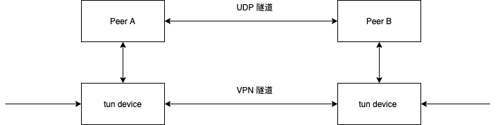

# nose (Graduation Design)
Design and implementation of VPN based on p2p network.


## Project structure



## Project requirements
This project built depends on some third party open sources.

Dependencies list:
```
libevent 
mbedtls 2.25.0
```

## Command line usage

```
nose is a very simple VPN implementation based on p2p

Usage: nose [master-peer|peer] 
    -c the configure file path


Examples:
On master peer:
nose master-peer -c master_peer.conf
On peer:
nose peer -c peer.conf

```
**Note**:

For the **Master Peer**, firstly make sure your firewall software allow to access to the port you assign to the program, or it will make the connection failed. Addtionally, although even you shutdown the firewall, the problem would still occur partly because your host provider builds the firewall in the traffic entrance of the server. To solve this, login to your console panel and add the accessible rules accordingly. 

For the **Peer**, the program should be run as superuser or other users which are equal to the privilege of superuser. 

## Configure file examples
For Master Peer, the content of ```.conf``` file should be defined as fallows:
```conf
mode=master peer # work mode, value is either "master peer" or "peer"
ipv4=172.20.10.3
port=9998 # local ip address and port you show should bind
master_peer_ipv4=172.20.10.4 
master_peer_port=9998 # the ip address and port of master peer in P2P network 
node_id=aaaaaaaaaaaaaaaaaaaa # the peer's node id
mstp_id=bbbbbbbbbbbbbbbbbbbb # the id of given master peer
```
For Peer:
```conf
mode=peer
source_ipv4=172.20.10.5 
source_port=45676 # local ip address and port you should bind
master_peer_ipv4=172.20.10.3
master_peer_port=9998
mstp_id=aaaaaaaaaaaaaaaaaaaa # A master peer in P2P network
stun_server_ipv4=172.20.10.3
vlan_remote_ipv4=172.16.10.3
vlan_local_ipv4=172.16.10.2 # local and remote peers' vlan address
key=b2c3d4f5j23Asds9b2c3d4f5j23Asds9 # The key for encrytion and decryption
```
## Tasklist

### Must do
- [x] Optimize the method of opening utun device   
- [x] Data traffic bewteen utun device and local client
- [x] TUN device implement in Linux platform
- [x] Implement a relatively safe and simple VPN

### May do

- [ ] Utun implement in Windows platform


### Known problems
* Vlan address conflict
* PMP packet verification(Check **Target ID** field)
* Symmetric NAT traversal
* Close the tun device when the program was exited by any reasons in Linux
